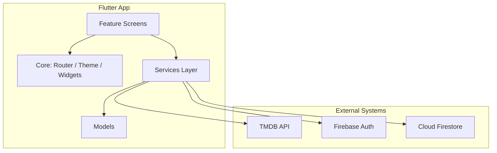

# FilmMend Me — Architecture Summary

**FilmMend Me** is a cross-platform **Flutter** app for mood-based movie recommendations, watchlists, and user profiles. It uses a **feature-oriented layout** with a thin **service layer**, but not full clean architecture (no repositories, no DI, no global state library).

---

## High-Level Overview



| Layer | Role |
|--------|------|
| **Presentation** | Screens per feature (`features/*/presentation/`) |
| **Services** | Firebase + TMDB access (`lib/services/`) |
| **Models** | `MovieModel`, `UserModel` |
| **Core** | Routing, theme, shared widgets, Firebase guards |

---

## App Bootstrap & Entry

1. **`main.dart`** — Loads optional `.env` (TMDB token), sets a global error widget, runs the app.
2. **`app.dart`** — Initializes Firebase (with a ~600ms minimum splash so the animation can play), then mounts `MaterialApp.router` with `appRouter`.
3. **`firebase_options.dart`** — Platform Firebase config (injected in CI for web deploy).

Startup is defensive: Firebase init can time out or fail, with retry UI instead of a hard crash.

---

## Navigation Architecture

**GoRouter** with a **3-tab shell**:

```
/ (home)          → Home tab (public)
/watchlist        → Watchlist tab (auth-gated in UI)
/profile          → Profile tab (auth-gated in UI)
/login, /register, /verify-email, /splash  → Outside shell
/movie/:id        → Full-screen detail (root navigator)
/home/recommendations → Results (pushed from home)
```

- **`StatefulShellRoute.indexedStack`** keeps tab state alive.
- **`AppShell`** wraps tabs with:
  - iOS: native liquid-glass `AdaptiveBottomNavigationBar`
  - Web/Android: custom Material nav bar
- **Protected routes are not router redirects** — watchlist/profile screens use `StreamBuilder` + `LoginRequiredView` / `VerificationRequiredView` inline.

---

## State Management Pattern

**No Provider / Riverpod / Bloc.** Pattern is:

- `StatefulWidget` for local UI state (mood selection, form fields, loading flags)
- `StreamBuilder` for Firebase auth and Firestore watchlist streams
- Services instantiated directly in widgets (`TmdbService()`, `AuthService()`, `WatchlistService()`)

This keeps the codebase small but couples screens to services.

---

## Feature Modules

| Feature | Responsibility |
|---------|----------------|
| **splash** | Branded splash (mostly superseded by bootstrap in `app.dart`) |
| **home** | Mood picker, runtime slider, navigates to recommendations |
| **recommendations** | Displays ranked TMDB results with “why picked” text |
| **movie_detail** | Full movie info, trailer links, watchlist toggle |
| **auth** | Login, register, email verification |
| **watchlist** | Real-time Firestore watchlist |
| **profile** | User info, stats, logout, account deletion |

Each feature is **presentation-only** — no `domain/` or `data/` subfolders.

---

## Services Layer

### `AuthService`
- Firebase Auth (email/password)
- Firestore user docs at `users/{uid}`
- Email verification, password reset, account deletion (including watchlist cleanup)

### `WatchlistService`
- Subcollection: `users/{uid}/watchlist/{movieId}`
- Real-time streams for list and per-movie status

### `TmdbService` (largest service)
- TMDB HTTP client with in-memory caching, deduped in-flight requests, retries
- **Recommendation engine**: mood → genre IDs → discover API → scoring/ranking → explainable reasons
- Mood→genre rules from Firestore `app_config/recommendation_rules` with hardcoded fallbacks
- Token from: CI placeholder replacement, `--dart-define`, or `.env`

---

## Data Models

- **`MovieModel`** — TMDB JSON parsing (list + detail), images, cast/crew, trailers, recommendation reason
- **`UserModel`** — Firestore user profile

Models live in `lib/models/` and are used by both services and UI.

---

## Authentication & Authorization

```
Firebase Auth (identity)
       ↓
safeCurrentUser() / safeAuthStateChanges()  ← guards if Firebase not ready
       ↓
Screen-level checks:
  - Not logged in → LoginRequiredView
  - Logged in, email unverified → VerificationRequiredView (watchlist actions)
```

`firebase_safe.dart` wraps Firebase calls so uninitialized Firebase does not crash the app.

---

## Theming & Shared UI

**`core/theme/`** — Dark theme, colors, text styles, constants.

**`core/widgets/`** — Reusable pieces:
- `MovieCard`, `GradientBackground`, `GradientButton`
- `LoginRequiredView`, `VerificationRequiredView`
- Platform-adaptive inputs via `adaptive_platform_ui` on auth/home flows

---

## External Dependencies & Config

| System | Usage |
|--------|--------|
| **TMDB API** | Movie discovery, search, details |
| **Firebase Auth** | Users |
| **Cloud Firestore** | Profiles, watchlists, remote recommendation config |
| **Firebase Hosting** | Web build deploy (GitHub Actions on `main`) |

Firestore schema (conceptual):

```
users/{uid}
  ├── displayName, email, createdAt, photoUrl
  └── watchlist/{movieId}
        └── title, posterPath, rating, genres, addedAt, ...

app_config/recommendation_rules
  └── moodGenres: { "Chill": [10749, 35, ...], ... }
```

---

## Deployment & Secrets

- **Web**: CI builds Flutter web, injects `firebase_options.dart` and TMDB token via `sed` into `tmdb_service.dart`
- **Android release**: `.env` is not bundled in release builds. Pass the TMDB token at build time:
  ```bash
  flutter build appbundle --release --dart-define=TMDB_READ_TOKEN=...
  ```
  Emulator/device testing: `flutter run -d android --dart-define=TMDB_READ_TOKEN=...` or use `.env` in debug only.
- **iOS / Android Firebase**: `google-services.json` / `GoogleService-Info.plist` (gitignored; copy from Firebase console or old machine). See `HANDOVER_NEW_MAC.md` for Play signing and version-code rules.
- **Local dev**: `.env` with `TMDB_READ_TOKEN` or `--dart-define=TMDB_READ_TOKEN=...`

---

## Architectural Characteristics

**Strengths**
- Clear feature folders and a single router entry point
- Rich recommendation logic centralized in `TmdbService`
- Real Firebase integration (not mocked in code)
- Platform-aware UI (iOS 26 native nav vs Material fallback)
- Resilient startup and API error handling

**Trade-offs / gaps**
- No formal state management or dependency injection
- No repository abstraction — screens call services directly
- Auth gating is UI-level, not router-level (tabs stay reachable when logged out)
- No offline persistence beyond in-memory TMDB cache
- No Android CI (web-only GitHub Actions deploy); no Crashlytics yet
- README still mentions “mocked” auth in places; the implementation is production Firebase

---

## Mental Model

Think of it as a **Flutter UI shell** over **two backends**:

1. **TMDB** — read-only movie data and recommendation logic (mostly client-side)
2. **Firebase** — identity, user data, watchlists, and remotely tunable mood rules

The app is optimized for **native iOS polish** and a **simple, direct codebase** rather than a layered enterprise architecture.
