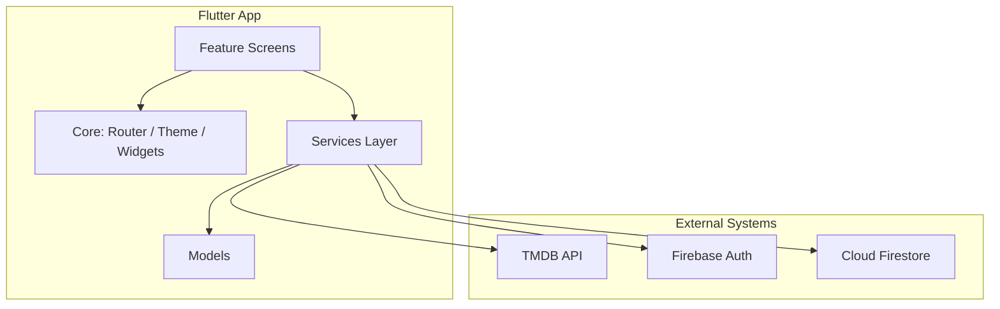

# FilmMend Me — Architecture Summary

**FilmMend Me** is a cross-platform **Flutter** app for mood-based movie recommendations, watchlists, and user profiles. It uses a **feature-oriented layout** with a thin **service layer**, but not full clean architecture (no repositories, no DI, no global state library).

**Maintaining this doc:** After implementing fixes, agents update this file to match the codebase and commit alongside code changes. See `.cursor/rules/project.mdc` → *After implementing fixes*.

---

## High-Level Overview



| Layer | Role |
|--------|------|
| **Presentation** | Screens per feature (`features/*/presentation/`) |
| **Services** | Firebase + TMDB access (`lib/services/`) |
| **Models** | `MovieModel`, `UserModel` |
| **Core** | Routing, theme, shared widgets, Firebase guards |

---

## App Bootstrap & Entry

1. **`main.dart`** — Loads optional `.env` (TMDB token), sets a global error widget, runs the app.
2. **`app.dart`** — Initializes Firebase (with a ~600ms minimum splash so the animation can play), configures Crashlytics, then mounts `MaterialApp.router` with `appRouter`.
3. **`firebase_options.dart`** — Platform Firebase config (injected in CI for web deploy).
4. **`core/firebase/crashlytics_bootstrap.dart`** — After Firebase init: `FlutterError.onError` and `PlatformDispatcher.onError` → Firebase Crashlytics (collection disabled in debug).

Startup is defensive: Firebase init can time out or fail, with retry UI instead of a hard crash.

---

## Navigation Architecture

**GoRouter** with a **3-tab shell**:

```
/ (home)          → Home tab (public)
/watchlist        → Watchlist tab (auth-gated in UI)
/profile          → Profile tab (auth-gated in UI)
/login, /register, /verify-email, /splash  → Outside shell
/movie/:id        → Full-screen detail (root navigator)
/home/recommendations → Results (pushed from home)
```

- **`StatefulShellRoute.indexedStack`** keeps tab state alive.
- **`AppShell`** wraps tabs with:
  - iOS: native liquid-glass `AdaptiveBottomNavigationBar`
  - Web/Android: custom Material nav bar
- **Protected routes are not router redirects** — watchlist/profile screens use `StreamBuilder` + `LoginRequiredView` / `VerificationRequiredView` inline.

---

## State Management Pattern

**No Provider / Riverpod / Bloc.** Pattern is:

- `StatefulWidget` for local UI state (mood selection, form fields, loading flags)
- `StreamBuilder` for Firebase auth and Firestore watchlist streams
- Services instantiated directly in widgets (`TmdbService()`, `AuthService()`, `WatchlistService()`)

This keeps the codebase small but couples screens to services.

---

## Feature Modules

| Feature | Responsibility |
|---------|----------------|
| **splash** | Branded splash (mostly superseded by bootstrap in `app.dart`) |
| **home** | Mood picker, runtime slider, navigates to recommendations |
| **recommendations** | Displays ranked TMDB results with “why picked” text |
| **movie_detail** | Full movie info, trailer links, watchlist toggle |
| **auth** | Login, register, Google Sign-In, email verification |
| **watchlist** | Real-time Firestore watchlist |
| **profile** | User info, stats, logout, account deletion |

Each feature is **presentation-only** — no `domain/` or `data/` subfolders.

---

## Services Layer

### `AuthService`
- Firebase Auth (email/password + **Google Sign-In**)
- Firestore user docs at `users/{uid}` (created on register or first Google sign-in)
- Email verification, password reset, account deletion (including watchlist cleanup)
- Google accounts are treated as verified (`emailVerified == true`) — no verification email

### `WatchlistService`
- Subcollection: `users/{uid}/watchlist/{movieId}`
- Real-time streams for list and per-movie status

### `TmdbService` (largest service)
- TMDB HTTP client with in-memory caching, deduped in-flight requests, retries
- **Recommendation engine**: mood → genre IDs → discover API → scoring/ranking → explainable reasons
- Mood→genre rules from Firestore `app_config/recommendation_rules` with hardcoded fallbacks
- Token from: CI placeholder replacement, `--dart-define`, or `.env`

---

## Data Models

- **`MovieModel`** — TMDB JSON parsing (list + detail), images, cast/crew, trailers, recommendation reason
- **`UserModel`** — Firestore user profile

Models live in `lib/models/` and are used by both services and UI.

---

## Authentication & Authorization

```
Firebase Auth (identity)
       ↓
safeCurrentUser() / safeAuthStateChanges()  ← guards if Firebase not ready
       ↓
Screen-level checks:
  - Not logged in → LoginRequiredView
  - Logged in, email unverified → VerificationRequiredView (watchlist actions)
  - Google Sign-In → skips verification email flow
```

`firebase_safe.dart` wraps Firebase calls so uninitialized Firebase does not crash the app. `safeAuthStateChanges()` emits `safeCurrentUser()` synchronously on subscribe before listening to `userChanges()`, so auth-gated tabs do not flash `LoginRequiredView` while the stream warms up.

### Google Sign-In (free, no custom domain)

Login and register screens offer **Continue with Google** (`google_sign_in` + `AuthService.signInWithGoogle()`). Web uses `signInWithPopup`; mobile uses the Google account picker.

**Firebase Console setup (one-time):**
1. **Authentication → Sign-in method → Google** → Enable
2. **Android:** add debug + release SHA-1/SHA-256 fingerprints (Project settings → Your apps → Android)
3. **iOS:** add `CFBundleURLTypes` URL scheme from `REVERSED_CLIENT_ID` in `GoogleService-Info.plist`
4. **iOS/Web client ID:** pass Web OAuth client ID at run/build when needed:
   `--dart-define=GOOGLE_WEB_CLIENT_ID=....apps.googleusercontent.com`
   (from Project settings → Web app → Web client ID; stored in `GoogleAuthConfig`)

### Email verification UX (email/password only)

Verification emails come from `noreply@filmmend-me.firebaseapp.com` and may land in spam without a custom domain. The verify screen and `VerificationRequiredView` show sender address + spam/promotions steps via `EmailVerificationTips`.

---

## Theming & Shared UI

**`core/theme/`** — Dark theme, colors, text styles, constants.

**`core/widgets/`** — Reusable pieces:
- `MovieCard`, `GradientBackground`, `GradientButton`
- `LoginRequiredView`, `VerificationRequiredView`, `EmailVerificationTips`
- `GoogleSignInButton`, `AuthDivider` on login/register
- Platform-adaptive inputs via `adaptive_platform_ui` on auth/home flows

---

## External Dependencies & Config

| System | Usage |
|--------|--------|
| **TMDB API** | Movie discovery, search, details |
| **Firebase Auth** | Users (email/password + Google Sign-In via `google_sign_in`) |
| **Cloud Firestore** | Profiles, watchlists, remote recommendation config |
| **Firebase Hosting** | Web build deploy (GitHub Actions on `main`) |
| **Firebase Crashlytics** | Production crash reports (Android/iOS; off in debug builds) |

Firestore schema (conceptual):

```
users/{uid}
  ├── displayName, email, createdAt, photoUrl
  └── watchlist/{movieId}
        └── title, posterPath, rating, genres, addedAt, ...

app_config/recommendation_rules
  └── moodGenres: { "Chill": [10749, 35, ...], ... }
```

---

## Deployment & Secrets

- **Web**: CI builds Flutter web, injects `firebase_options.dart` and TMDB token via `sed` into `tmdb_service.dart`
- **Android release**: `.env` is not bundled in release builds. Pass the TMDB token at build time:
  ```bash
  flutter build appbundle --release --dart-define=TMDB_READ_TOKEN=...
  ```
  Emulator/device testing: `flutter run -d android --dart-define=TMDB_READ_TOKEN=...` or use `.env` in debug only.
- **iOS / Android Firebase**: `google-services.json` / `GoogleService-Info.plist` (gitignored; copy from Firebase console or old machine). See `HANDOVER_NEW_MAC.md` for Play signing and version-code rules.
- **Local dev**: `.env` with `TMDB_READ_TOKEN` or `--dart-define=TMDB_READ_TOKEN=...`

### Cursor / VS Code (Android Gradle)

On macOS, Cursor’s Java extension may show **“The supplied phased action failed with an exception”** on `android/build.gradle.kts` when no JDK is registered with the OS. The Gradle files are fine; the IDE cannot sync without a JDK path.

**Workspace fix** (`.vscode/settings.json`): point the Java language server and Gradle import at Android Studio’s bundled JBR:

```json
"java.jdt.ls.java.home": "/Applications/Android Studio.app/Contents/jbr/Contents/Home",
"java.import.gradle.java.home": "/Applications/Android Studio.app/Contents/jbr/Contents/Home"
```

After changing JDK settings: **Command Palette → Java: Clean Java Language Server Workspace → Reload**.

Terminal Gradle (independent of IDE): `export JAVA_HOME="/Applications/Android Studio.app/Contents/jbr/Contents/Home"` then `cd android && ./gradlew projects`.

---

## Architectural Characteristics

**Strengths**
- Clear feature folders and a single router entry point
- Rich recommendation logic centralized in `TmdbService`
- Real Firebase integration (not mocked in code)
- Platform-aware UI (iOS 26 native nav vs Material fallback)
- Resilient startup and API error handling
- Firebase Crashlytics for release crash reporting

**Trade-offs / gaps**
- No formal state management or dependency injection
- No repository abstraction — screens call services directly
- Auth gating is UI-level, not router-level (tabs stay reachable when logged out)
- No offline persistence beyond in-memory TMDB cache
- No Android CI (web-only GitHub Actions deploy)
- README still mentions “mocked” auth in places; the implementation is production Firebase

---

## Mental Model

Think of it as a **Flutter UI shell** over **two backends**:

1. **TMDB** — read-only movie data and recommendation logic (mostly client-side)
2. **Firebase** — identity, user data, watchlists, and remotely tunable mood rules

The app is optimized for **native iOS polish** and a **simple, direct codebase** rather than a layered enterprise architecture.

---

## Emulator Testing (Pre–Play Store)

### Run commands

**Debug** (uses bundled `.env` for TMDB when present):

```bash
flutter run -d android
```

**Release APK on emulator** (matches Play minification; TMDB requires token at build time):

```bash
flutter build apk --release --dart-define=TMDB_READ_TOKEN=YOUR_TOKEN
adb uninstall com.filmmend.me   # required when switching debug ↔ release signing
adb install build/app/outputs/flutter-apk/app-release.apk
```

**Play upload artifact:**

```bash
flutter build appbundle --release --dart-define=TMDB_READ_TOKEN=YOUR_TOKEN
```

### Manual test checklist

| Area | Steps | Pass criteria |
|------|--------|----------------|
| **Startup** | Cold launch | Splash → home; no crash |
| **Home** | Pick mood + runtime → Get recommendations | Results load with posters and “why picked” text |
| **Movie detail** | Tap a card | Detail, cast, trailer link open |
| **Auth** | Register → verify email flow | Verification screen blocks back; resend works |
| **Watchlist** | Logged out → tab | `LoginRequiredView`; after login + verify, add/remove movie |
| **Profile** | Logout, delete account (test account) | Navigates correctly; `requires-recent-login` signs out to login |
| **Back** | System back on tabs / detail | Predictive back behaves; no stuck routes |
| **Release build** | Install release APK | App opens; recommendations work (token was passed at build) |

### Known emulator pitfalls

- **WiFi after wipe** — DNS fails until WiFi connects (~30–60s after cold boot). `ping google.com` from adb is a quick check; enable WiFi or wait before testing API flows.
- **No DNS / offline Firestore** — if WiFi never connects, logs show `Unable to resolve host`; use **Cold Boot Now** or recreate the AVD.
- **Debug vs release signing** — `INSTALL_FAILED_UPDATE_INCOMPATIBLE` → `adb uninstall com.filmmend.me` first.
- **`.env`** — listed in `pubspec.yaml` assets for debug; release/Android store builds still need `--dart-define=TMDB_READ_TOKEN=...`.
- **Lag on low-RAM Macs** — 8 GB total RAM forces software GPU rendering; use `flutter run --release -d android` for smoother emulator runs, or prefer a lighter AVD (below).

### Recommended AVD (no physical device)

On memory-tight Macs (e.g. 8 GB), avoid **API 37 + 16 KB (ps16k)** images — they are heavy. Prefer:

| Setting | Value |
|---------|--------|
| Device | Pixel 6 (or similar) |
| System image | **API 34 or 35**, Google Play — **not** “16 KB Page Size” |
| AVD RAM | **2048 MB** (not 4096+ on 8 GB hosts) |

Create via **Android Studio → Device Manager → Create Device**. No phone required for dev; use Play **Internal testing** for a final install check on any borrowed Android device before production.

---

## Play Store Readiness

A full readiness audit was completed on 2026-06-22. The app is **upload-ready** for Android Play Store.

### What was fixed

| # | File | Change |
|---|------|--------|
| 1 | `pubspec.yaml` | Updated `description` from Flutter template default to a real description |
| 2 | `android/app/build.gradle.kts` | Removed stale `TODO` comment about application ID |
| 3 | `lib/features/profile/presentation/profile_screen.dart` | `requires-recent-login` error now signs the user out and navigates to `/login` instead of showing a dead-end snackbar |
| 4 | `android/app/build.gradle.kts` | Enabled R8 minification (`isMinifyEnabled`, `isShrinkResources`) for release builds |
| 5 | `android/app/proguard-rules.pro` | New file — keep rules for Flutter, Firebase, Crashlytics, Kotlin; `SourceFile,LineNumberTable` preserved for readable Crashlytics stack traces |

### Remaining known gaps (not blockers)

- README still says auth is "mocked" — it is real Firebase; README needs a one-line correction
- No Android CI pipeline (web-only GitHub Actions)
- Auth gating is UI-level, not router-level

---

## Recent Dev Environment Fix (2026-06-22)

| File | Change |
|------|--------|
| `.vscode/settings.json` | JDK paths for Java/Gradle extension (Android Studio JBR); automatic Gradle build configuration |
| `docs/ai-context.md` | Documented Cursor Gradle sync / JDK setup (this section) |

No changes to `android/build.gradle.kts` — root Gradle script is standard Flutter boilerplate; red IDE errors were JDK configuration only.

---

## Pre–Play Store Emulator Pass (2026-06-22)

| File | Change |
|------|--------|
| `pubspec.yaml` | Added `.env` to Flutter assets so `dotenv.load` works in debug/emulator runs |
| `lib/features/auth/presentation/verify_email_screen.dart` | Replaced deprecated `WillPopScope` with `PopScope(canPop: false)` for Android predictive back |
| `docs/ai-context.md` | Emulator test commands, checklist, and pitfalls (section above) |

**Automated checks:** `flutter analyze` clean; debug APK installed on emulator (API 37); `flutter build apk --release` succeeds with R8 minification. Manual UI pass pending on a lighter AVD (user creating API 34/35 emulator).

---

## Emulator Test Pass (2026-06-22)

App run on Pixel 6a (API 34) emulator via `flutter run`. No Flutter exceptions found. All major flows tested and passing.

| # | Finding | Severity | Resolution |
|---|---------|----------|------------|
| 1 | `RecommendationResultsScreen.maxMinutes` was misnamed — field and constructor param were called `maxMinutes` but represent a **minimum** runtime filter (used as `with_runtime.gte` in TMDB, labelled "Minimum Duration" in UI) | Bug | **Fixed** — renamed to `minMinutes` in `recommendation_results_screen.dart` and `router.dart` |
| 2 | `LoginRequiredView` flashed for one frame on Watchlist and Profile tab switch when logged in | Bug | **Fixed** — added `initialData: safeCurrentUser()` to `StreamBuilder<User?>` in `watchlist_screen.dart`, `profile_screen.dart`, and `home_screen.dart` (verification banner). `StreamBuilder` initial build has `snapshot.data == null` before the first stream event, even when the stream emits synchronously; `initialData` bypasses this. |
| 3 | Firestore `PERMISSION_DENIED` on `app_config/recommendation_rules` | Infrastructure | Local `firestore.rules` is correct (`allow read: if true`) but rules haven't been deployed to Firebase. App falls back to hardcoded `fallbackMoodGenres` — no user-facing crash. Fix: run `firebase deploy --only firestore:rules` |

**Emulator noise (not real bugs):** `GoogleApiManager` / `FlagRegistrar` / `FlagStore` errors are emulator-internal GMS service issues. Frame skipping is expected with software rendering on low RAM.

---

## Pending Feature Work

From the roadmap in `README.md`, none of these are started:

- [ ] Movie search
- [ ] User reviews and ratings
- [ ] Social sharing of recommendations
- [ ] Dark / Light theme toggle
- [ ] Localization
- [ ] Offline caching (beyond in-memory TMDB cache)
- [ ] Push notifications for new releases

---

## Play Store Bug-Fix Pass (2026-06-22)

Comprehensive audit and fix of 28 bugs across the codebase. `flutter analyze` clean after all changes.

### P1 — Crash / Data Loss

| # | File | Fix |
|---|------|-----|
| 1 | `lib/core/router/router.dart` | Route `extra` safe-cast: `state.extra as Map<String, dynamic>?` → `extra is Map ? extra : null`; same for `verifyEmail` string extra |
| 2 | `lib/services/auth_service.dart` | `deleteAccountAndData()`: call `user.delete()` **before** Firestore deletes so a `requires-recent-login` failure does not wipe data from a still-active account |
| 3 | `lib/app.dart` | Firebase bootstrap retry: guard `Firebase.initializeApp()` with `Firebase.apps.isNotEmpty` check; catch `[core/duplicate-app]` to prevent permanent error screen on slow-network retry |

### P2 — Broken Behavior

| # | File | Fix |
|---|------|-----|
| 4 | `lib/features/watchlist/presentation/watchlist_screen.dart` | `Dismissible`: replaced `onDismissed` (fire-and-forget) with `confirmDismiss` that awaits `ws.removeMovie()` and returns `false` on error — prevents item disappearing on failed delete |
| 5 | `lib/features/auth/presentation/login_screen.dart`, `register_screen.dart` | Added `if (!mounted) return;` to all `catch` blocks; added `if (_isLoading \|\| _isGoogleLoading) return;` double-submit guard to email flows |
| 6 | `lib/features/profile/presentation/profile_screen.dart` | Delete dialog: capture `GoRouter.of(context)` before `Navigator.pop()` so `requires-recent-login` path correctly signs out and navigates to login; same fix for logout dialog |
| 7 | `lib/features/recommendations/presentation/recommendation_results_screen.dart`, `lib/features/movie_detail/presentation/movie_detail_screen.dart` | `context.pop()` → `canPop()` guard with `context.go(RouteNames.home)` fallback on all back buttons |
| 8 | `lib/features/movie_detail/presentation/movie_detail_screen.dart` | Guest login path: check `loggedInUser.emailVerified` after login pop before adding to watchlist |
| 9 | `android/app/src/main/AndroidManifest.xml` | Added `<queries>` intent for `https` scheme — required for `url_launcher` on Android 11+ |
| 10 | `android/app/proguard-rules.pro` | Added explicit keep rules for `com.google.android.gms.auth.**`, Firestore, protobuf reflection, and `*Annotation*` |
| 11 | `pubspec.yaml` | Removed `.env` from `assets:` — prevents TMDB token from being bundled into release APK/AAB; `dotenv.load()` failure is already silently caught in `main.dart` |

### P3 — Logic / Edge Cases

| # | File | Fix |
|---|------|-----|
| 12 | `lib/services/tmdb_service.dart` | `searchMovies` / `getPopularMovies`: `data['results'] as List<dynamic>` → `as List<dynamic>? ?? const []`; wrapped in try/catch with `TmdbException` rethrow |
| 13 | `lib/models/movie_model.dart` | Hardened `fromJson` casts: genre objects use `.whereType<Map>()` + null-safe field reads; `genre_ids` uses `(e as num).toInt()`; same for `productionCompanies` and `spokenLanguages` |
| 14 | `lib/models/user_model.dart` | `UserModel.fromFirestore`: `doc.data() as Map<String, dynamic>?` with null fallback to default model |
| 15 | `lib/services/auth_service.dart` | `signOut()`: also calls `_createGoogleSignIn().signOut()` so Android account picker appears on next Google sign-in |
| 16 | `lib/services/auth_service.dart` | `resendVerificationEmail()`: throws `FirebaseAuthException(code: 'no-current-user')` when `currentUser` is null instead of silently no-oping |
| 17 | `lib/features/auth/presentation/verify_email_screen.dart` | Added `_polling` flag shared between timer and manual check paths to prevent concurrent `reloadCurrentUser()` calls |
| 18 | `lib/features/recommendations/presentation/recommendation_results_screen.dart` | Filter bottom sheet: `Padding` → `SingleChildScrollView` to prevent `RenderFlex overflow` on small/short Android devices |
| 19 | `lib/features/movie_detail/presentation/movie_detail_screen.dart` | `_movie = movie` was assigned inside `build()` (undefined behavior); moved to `initState().then()` |
| 20 | `lib/features/profile/presentation/profile_screen.dart` | Converted `StatelessWidget` → `StatefulWidget`; `_getProfileFuture(uid)` caches the future keyed on uid so Firestore isn't re-fetched on every `userChanges()` emission; added error state with retry |

### P4 — UX Polish

| # | File | Fix |
|---|------|-----|
| 21 | `lib/features/movie_detail/presentation/movie_detail_screen.dart` | Trailer launch: show SnackBar "Could not open trailer." when `launchUrl` returns false or throws |
| 22 | `lib/features/movie_detail/presentation/movie_detail_screen.dart` | Watchlist `StreamBuilder<bool>`: added `snap.hasError` branch (shows disabled button) and loading state |
| 23 | `lib/core/router/router.dart` | Added `errorBuilder` to `GoRouter` — shows a friendly "Page not found" screen with Go Home button |
| 24 | `android/app/src/main/AndroidManifest.xml` | `android:label` changed from `"Filmmend Me"` to `"FilmMend Me"` to match in-app branding |
| 25–28 | `lib/features/watchlist/presentation/watchlist_screen.dart` | Hardcoded TMDB image URL → `TmdbImageConfig.w500()`; `genres` cast → `.map((e) => e.toString())`; filter out entries with null `movieId`; `register_screen.dart` Google sign-in now mirrors login (`canPop()` → `pop(true)`) |

---

## Google Sign-In + verification UX (2026-06-22)

| File | Change |
|------|--------|
| `pubspec.yaml` | Added `google_sign_in` |
| `lib/services/auth_service.dart` | `signInWithGoogle()`, Firestore user bootstrap for new Google users |
| `lib/core/firebase/google_auth_config.dart` | Web client ID (`GOOGLE_WEB_CLIENT_ID`), verification sender constant |
| `lib/core/widgets/google_sign_in_button.dart` | `GoogleSignInButton`, `AuthDivider` |
| `lib/core/widgets/email_verification_tips.dart` | Spam/promotions guidance + sender address |
| `lib/features/auth/presentation/login_screen.dart` | Google sign-in button |
| `lib/features/auth/presentation/register_screen.dart` | Google sign-in (no verification email) |
| `lib/features/auth/presentation/verify_email_screen.dart` | Prominent spam-folder tips |
| `lib/core/widgets/verification_required_view.dart` | Same tips on gated screens |
